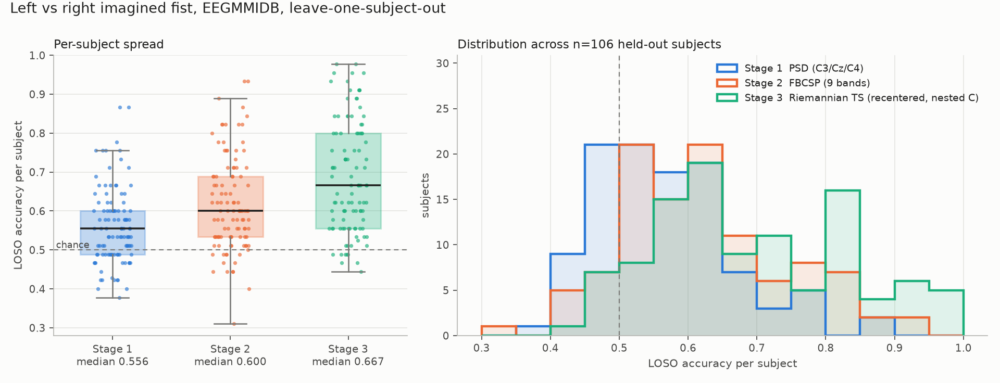

# Left vs right fist motor imagery on EEGMMIDB

Cross-subject decoding of imagined left- vs right-fist movement from 64-channel scalp EEG
(PhysioNet EEGMMIDB, 106 subjects). Three feature pipelines were built in sequence
(Welch band power, filter-bank CSP, Riemannian tangent space) and every one of them was
evaluated under the same leave-one-subject-out protocol, with a set of controls designed to
answer "what else could explain this number?" before anyone asks.

**Headline, with its conditions attached:** 68.7% ± 14.2% (mean ± sd across 106 held-out
subjects, ROC-AUC 0.74) for the Riemannian pipeline, with the regularization strength chosen
by nested cross-validation and *no labels* from the test subject. The same pipeline with an
unregularized classifier scores 60.9%; the per-subject range is 44%–98%; and the number
only holds if the new subject supplies a batch of unlabeled trials for recentering (see
[What the model cannot do](#what-the-model-can-and-cannot-do)).



## Quickstart

```bash
python -m venv .venv && source .venv/bin/activate
pip install -r requirements.txt            # pinned, python 3.12

# predict on any EEGMMIDB fist run (the dataset can be fetched with mne; see below)
python predict.py ~/mne_data/MNE-eegbci-data/files/eegmmidb/1.0.0/S001/S001R04.edf

# several runs of one subject in one call gives recentering a better reference
python predict.py S001R04.edf S001R08.edf S001R12.edf
```

`predict.py` reads a raw EDF, applies the training preprocessing, runs the saved model
(`models/riemannian_model.joblib`, 65 kB) and prints one row per trial with the predicted
label, the T1/T2 annotation and the accuracy against it. If the model file is missing it fits
one from cached epochs (needs the dataset). It resamples 128 Hz files, warns if the run is
not a left/right-fist run, and refuses files missing any of the 64 training channels.

Fetching the data (about 0.8 GB for the imagery runs of all subjects):

```python
from mne.datasets import eegbci
for s in range(1, 110): eegbci.load_data(s, [3, 4, 7, 8, 11, 12], update_path=True)
```

Reproducing the results (each script appends fold-level rows to `results/stage*_metrics.csv`):

```bash
python scripts/evaluate_fourier_baseline.py --subjects 0                   # stage 1
python scripts/evaluate_fbcsp.py --subjects 0                              # stage 2
python scripts/evaluate_loso_controls.py --mode loso                       # stage 1+2 LOSO, plus modes:
#   negative_control  leakage_test  executed_transfer  csp_validation  subject_norm  within_subject
python scripts/evaluate_riemannian.py --mode nested_loso                   # stage 3, plus modes:
#   loso  group_kfold  leakage_test  negative_control  executed_transfer  c_sweep   (--head-C 1e-4)
python scripts/summarize_stages.py                                         # unified tables + figure
python scripts/train_final_model.py --C 1e-4                               # refit models/riemannian_model.joblib
```

## Layout

```
src/data_loader.py      fetch, montage, 1-35 Hz FIR, 0.5-3.5 s epochs, subject exclusion
src/cache.py            .npz epoch cache (cache/, git-ignored)
src/features_psd.py     stage 1: Welch log band power, mu + beta
src/fbcsp.py            stage 2: filter bank + per-band CSP + mutual-information selection
src/csp_fast.py         CSP in the covariance domain (LOSO by subtracting the held-out subject)
src/riemannian.py       stage 3: LWF covariance, per-subject recentering, tangent space, classifier
src/results.py          shared append-only results writer
scripts/                evaluation drivers, summary/figure, final-model training
predict.py              CLI: raw EDF -> predicted labels
models/                 the shipped model
results/                fold-level csvs, per-subject LOSO scores, figures
```

## Results

All rows: 106 subjects, imagery runs 4/8/12, 4767 trials, 3 s window, 64 channels.
LOSO = leave-one-subject-out (106 folds, mean ± sd over subjects). GroupKFold = 5 folds of
~21 subjects. exec→imag = trained on executed runs 3/7/11 of the training subjects, tested on
imagined runs of held-out subjects.

| Stage | Method | features | LOSO acc | LOSO AUC | GroupKFold5 | exec→imag |
|---|---|---|---|---|---|---|
| 1 | Welch PSD, C3/Cz/C4, mu+beta | 6 | 56.1 ± 9.7 | 0.58 | 54.7 | 55.0 |
| 1 | Welch PSD, all 64 channels | 128 | 56.2 ± 8.7 | 0.61 | 55.5 | — |
| 2 | FBCSP 4–40 Hz, 9 bands, 4 comp, MI top-12 | 12 | 61.8 ± 12.1 | 0.71 | 62.9 | — |
| 3 | Tangent space 7–30 Hz, no recentering, C=1 | 2080 | 57.1 ± 10.3 | 0.62 | 57.6 | 59.5 |
| 3 | + per-subject recentering, C=1 | 2080 | 60.9 ± 11.4 | 0.65 | 61.6 | 64.5 |
| 3 | + recentering, C=1e-4 (shipped model) | 2080 | **68.8 ± 14.3** | **0.74** | **68.2** | **68.6** |
| 3 | + recentering, C chosen by nested CV | 2080 | **68.7 ± 14.2** | **0.74** | — | — |

Per-subject spread of the LOSO scores (`results/loso_distributions_wide.csv`):

| | PSD | FBCSP | Riemannian (nested C) |
|---|---|---|---|
| median | 55.6 | 60.0 | 66.7 |
| subjects > 60% | 23.6% | 44.3% | 62.3% |
| subjects > 70% | 9.4% | 23.6% | 44.3% |
| subjects ≤ 50% | 29.2% | 13.2% | 7.5% |
| min / max | 37.8 / 86.7 | 31.1 / 93.3 | 44.4 / 97.8 |

The Riemannian pipeline beats FBCSP on 77 of 106 subjects (ties on 10). Per-subject scores
correlate 0.5–0.6 across the three methods: a subject who is hard for one is hard for all,
which is the usual "BCI illiteracy" picture rather than a method artifact.

## Pipeline

**Subjects.** 109 in the dataset, 106 used. S088, S092 and S100 were recorded at 128 Hz instead
of 160 Hz and their trial timing does not match the rest of the dataset (S088 and S092 have
19 T1/T2 events per run and S100 has 12, where every other subject has 15 in a run of the
same length). They were excluded from training and evaluation
rather than resampled in, so they double as genuinely unseen subjects for `predict.py`.

**Preprocessing** (`src/data_loader.py`, identical in training and in `predict.py`):
standard channel names and 10-20 montage; 1–35 Hz zero-phase FIR on the continuous
recording; epochs 0.5–3.5 s after the T1/T2 cue (the first half second is dropped to
avoid the visual evoked response to the cue and to start inside the ERD window); no
baseline correction. **No trial rejection and no ICA.** Noise is handled inside the
feature step instead: Ledoit-Wolf shrinkage makes every 64×64 trial covariance well
conditioned, and per-subject recentering removes the subject-specific scaling and
channel-coupling structure (head geometry, impedances, resting rhythm) that dominates
raw covariances. I checked that the CSP filters learned on the full cohort are
sensorimotor-lateralized in the mu and beta bands (`results/csp_patterns_*.png`); the
last component in each band picks up single noisy channels, which is why the FBCSP
stage keeps a mutual-information selection step rather than all components.

**Stage 1, Welch PSD.** 256-sample Welch segments, log power in 8–12 Hz and 13–30 Hz, either
from C3/Cz/C4 (6 features) or all channels (128). StandardScaler + logistic regression.

**Stage 2, FBCSP.** Nine 4 Hz bands from 4 to 40 Hz (4th-order zero-phase Butterworth), one
CSP per band with 4 filters, log-variance features, top 12 by mutual information, StandardScaler
+ logistic regression. CSP is fit in the covariance domain (`src/csp_fast.py`): the class
covariance of a training fold is the cohort covariance minus the held-out subject's, so 106
LOSO folds take 99 s. This implementation was checked against `mne.decoding.CSP` on identical
splits (54.8% vs 54.2%, inside fold noise).

**Stage 3, Riemannian tangent space.** 7–30 Hz zero-phase Butterworth on the epochs, Ledoit-Wolf
covariance per trial, **recentering**: each subject's covariances are whitened by the inverse
square root of that subject's own Riemannian mean, so every subject's trials sit around the
identity. Tangent-space projection at the identity then gives 2080 features per trial;
StandardScaler + L2 logistic regression. Recentering uses no labels, only the subject's trials.

## What the evaluation establishes

**Train/test share nothing about the person.** Every headline number is leave-one-subject-out:
the test subject's trials appear nowhere in training, feature fitting, scaling or feature
selection. GroupKFold(5) is reported as well because early development used it (it agrees with
LOSO to within 1 pp for every method).

**How much subject identity would have inflated a naive split.** Re-running with
`StratifiedKFold` (trials of the same person on both sides):

| method | grouped | subject-blind | inflation |
|---|---|---|---|
| PSD C3/Cz/C4 | 54.7 | 55.8 | +1.1 |
| FBCSP | 62.9 | 61.3 | −1.6 |
| Riemannian, recentered, C=1 | 61.6 | 62.7 | +1.1 |
| Riemannian, recentered, C=1e-4 | 68.2 | 68.3 | +0.1 |

Small, because these models are low-capacity for this feature space and because
recentering removes most of the per-subject signature that a subject-blind split leaks.
It is not zero for the unregularized model, and the within-subject numbers below show
where the leak would be larger.

**The signal comes from motor cortex.** Same pipeline, three channel sets, GroupKFold(5):

| channels | PSD | Riemannian recentered (C=1e-4) |
|---|---|---|
| C3, Cz, C4 (sensorimotor) | 54.7 | **61.5** |
| O1, Oz, O2 (occipital) | 52.9 | 51.7 |
| Fp1, Fp2 (frontal) | 52.7 | 50.4 |

Occipital and frontal sit at chance; the same 6-dimensional feature space over sensorimotor
channels does not. Three sensorimotor channels recover most of what 64 channels give
(61.5 vs 68.2), i.e. the cross-subject signal is mainly the C3/C4 covariance structure.

**Executed movement transfers to imagery.** A model trained only on executed left/right fist
(runs 3/7/11) and tested on the *imagined* runs of unseen subjects scores 68.6%, against 73.0%
when tested on their executed runs: a 4.4 pp penalty, and the same accuracy as training on
imagery directly (68.7%). Executed and imagined movement share their spatial covariance
structure closely enough that execution data is a valid way to bootstrap an imagery decoder.

**Learned, not memorized.** The tangent space has 2080 dimensions and the cohort has ~4700
trials from 105 training subjects, so an unregularized classifier fits subject-specific
structure (train 99.8%, LOSO 60.9%). Sweeping the L2 strength:

| C | 1 | 0.1 | 0.01 | 1e-3 | 3e-4 | 1e-4 | 1e-5 |
|---|---|---|---|---|---|---|---|
| train | 99.8 | 95.2 | 90.4 | 84.9 | 81.0 | 77.6 | 73.2 |
| LOSO | 60.9 | 62.8 | 65.0 | 67.9 | 68.4 | 68.8 | 68.0 |

Because picking C on LOSO accuracy is itself test-set selection, the reported 68.7% comes
from **nested** LOSO: for each held-out subject, C is chosen by GroupKFold on the other 105
(it chose 1e-4 in 64 folds and 3e-4 in 42, never anything larger). The shipped model uses
1e-4. The plateau from 1e-5 to 1e-3 says the result is not sensitive to the exact value.

**Within-subject is not the easy case here.** Training and testing inside one person
(45 trials, stratified 5-fold) gives 54.1% for PSD and 54.8% for FBCSP: 36 training trials
is too few to fit anything. The cross-subject models beat within-subject models on this
dataset, which is the opposite of the usual BCI story and a direct consequence of
EEGMMIDB's single short session per subject.

**Sanity checks on the pipeline.** `csp_validation` (custom CSP vs MNE), `subject_norm`
(per-subject z-scoring of FBCSP features, no gain), `c_sweep`, and `predict.py` on an
excluded subject: S092, never seen and recorded at 128 Hz, scores 14/19 on run 4 alone and
40/57 (70%) over its three imagery runs. One subject, so a ±12 pp interval; it is a
consistency check, not a result.

## Design decision: FBCSP or Riemannian recentering

Both were fully built and evaluated. With the same unregularized head they tie (61.8 vs
60.9, well inside the ±1.1 pp standard error of a 106-subject mean), FBCSP wins on 64
subjects, and FBCSP has the smaller feature vector. The choice was made on structure, not
on that gap:

* FBCSP's spatial filters are fit on the training cohort and applied unchanged to a new
  head; nothing adapts to the new subject. Recentering is an explicit, label-free step that
  maps each new subject's covariance distribution onto the training cohort's, and that is
  exactly the transfer problem this task is about. It is why the Riemannian pipeline gains
  4 pp from recentering alone and a further 8 pp once the classifier stops memorizing.
* FBCSP has more places to overfit the *design* (band edges, components per band, k, the
  selection criterion) and each was tuned by looking at cross-subject scores. The Riemannian
  pipeline has one band and one C, and C was selected inside the folds.
* The transfer result (execution → imagery, 68.6%) only holds with recentering; without it
  the same features drop to 61.5%.

The cost is real and is stated in the next section: recentering needs a batch of the new
subject's trials before the first prediction.

## What the model can and cannot do

* Binary left vs right fist only. T0 rest is never seen, so every trial gets one of the two
  labels; it will happily classify a both-feet trial as left or right.
* Requires the 64-channel 10-10 montage with these channel names. Other caps need a channel
  mapping and, honestly, retraining.
* **Not single-trial from cold.** Recentering needs the new subject's trials to estimate a
  reference mean. `predict.py` uses all trials in the files given (15 per run). With one run
  the reference is estimated from 15 trials against 45 in training; S092 scored 74% on one run
  and 70% on three, so no visible damage at that size, but I have not measured the curve below
  15. An online system would need a short unlabeled calibration recording.
* One session per subject in this dataset, so **session-to-session drift is unmeasured**.
  That is the transfer axis this dataset cannot speak to.
* Expect 44%–98% on an individual: the mean is not a promise for a person.

## Weakest points

1. **A single static covariance per trial.** ERD starts, deepens and rebounds over the 3 s
   window, and a covariance over the whole window averages that time course away. If the
   discriminative interval differs across people (it does: onset latency varies by hundreds of
   ms), a fixed window is leaving accuracy and robustness on the table, and it is where I
   would expect a deep temporal model or a sliding-window tangent-space model with attention
   over windows to help most. The conclusion "Riemannian > FBCSP" could flip if FBCSP were
   given the same temporal freedom.
2. **The "no labels from the new subject" claim is zero-label, not zero-data.** Recentering is
   transductive. If a deployment cannot collect ~15 unlabeled trials first, the applicable
   number is the non-recentered row (57–62%), not 68.7%.
3. **Design-level selection.** C was chosen inside the folds, but the band (7–30 Hz), the
   window, the covariance estimator and the exclusion of three subjects were chosen while
   looking at cross-subject results. I would put that optimism at a point or two, not ten,
   because every alternative tried moved the number by less than the fold-to-fold noise.
4. **Trial count.** 45 trials per subject makes per-subject accuracies coarse (one trial =
   2.2 pp), which inflates the per-subject spread and makes the illiteracy tail hard to
   separate from noise.

## Things I noticed that were not asked

* **Three subjects are a different dataset.** S088, S092 and S100 are sampled at 128 Hz and
  their event timing differs from the other 106; a pipeline that concatenates everyone
  silently mixes two acquisition setups. This is not documented on the PhysioNet page.
* **Three electrodes carry most of the cross-subject signal.** A 6-feature recentered
  tangent space over C3/Cz/C4 reaches 61.5%, versus 68.2% for 2080 features over 64
  channels; the other 61 channels add 7 pp and most of the overfitting surface.
* **Executed and imagined fists are nearly interchangeable for a cross-subject decoder**
  once covariances are recentered (68.6% vs 68.7%), which is a practical shortcut for
  collecting training data: execution is easier to instruct and to verify than imagery.

## With more time and compute

* Time-resolved covariances (several windows per trial, or a learned temporal kernel) with
  the same LOSO harness, to test weak point 1 directly.
* A calibration-size curve: LOSO accuracy as a function of how many unlabeled trials the
  new subject contributes to recentering (1, 5, 10, 15, 45).
* A few-shot row: how much does 5 or 10 *labeled* trials from the new subject add on top
  of recentering (per-subject fine-tuning of the linear head).
* Deep baselines (EEGNet, ShallowConvNet) with Euclidean alignment, trained under the
  identical nested-LOSO protocol so the comparison is fair.
* Four classes including rest, and a dataset with multiple sessions per subject
  (BCI Competition IV 2a) to measure the session axis this dataset cannot.

## AI use

I used an LLM coding assistant throughout. It wrote most of the boilerplate: the MNE
loading and caching code, the results writer, the evaluation drivers, the CLI, plotting,
and it proposed the covariance-domain CSP trick that made 106-fold LOSO cheap enough to
iterate on. The decisions in this document are mine: which subjects to exclude and why,
LOSO as the primary protocol, which controls to run, choosing recentering over FBCSP,
and the regularization investigation after noticing 99.8% training accuracy.

One choice in my own words: the negative-control channel sets. A 68% cross-subject number
could come from anything that differs between left and right trials, including eye movement
toward the cue side or a subject-specific artifact the model has learned as a proxy. Running
the identical pipeline on frontal channels (which see eye movement best) and occipital
channels (which see the visual cue best) and getting chance from both, while three
sensorimotor channels give 61.5%, is the most direct evidence I have that the model reads
motor cortex and not the cue or the eyes.

## References

* Schalk G. et al., BCI2000: a general-purpose brain-computer interface system. IEEE TBME 51(6), 2004.
* Goldberger A.L. et al., PhysioBank, PhysioToolkit, and PhysioNet. Circulation 101(23), 2000.
* Barachant A. et al., Multiclass brain-computer interface classification by Riemannian geometry. IEEE TBME 59(4), 2012.
* Zanini P. et al., Transfer learning: a Riemannian geometry framework with applications to BCI. IEEE TBME 65(5), 2018.
* Ang K.K. et al., Filter bank common spatial pattern (FBCSP) in brain-computer interface. IJCNN 2008.
